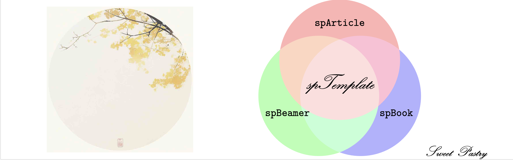
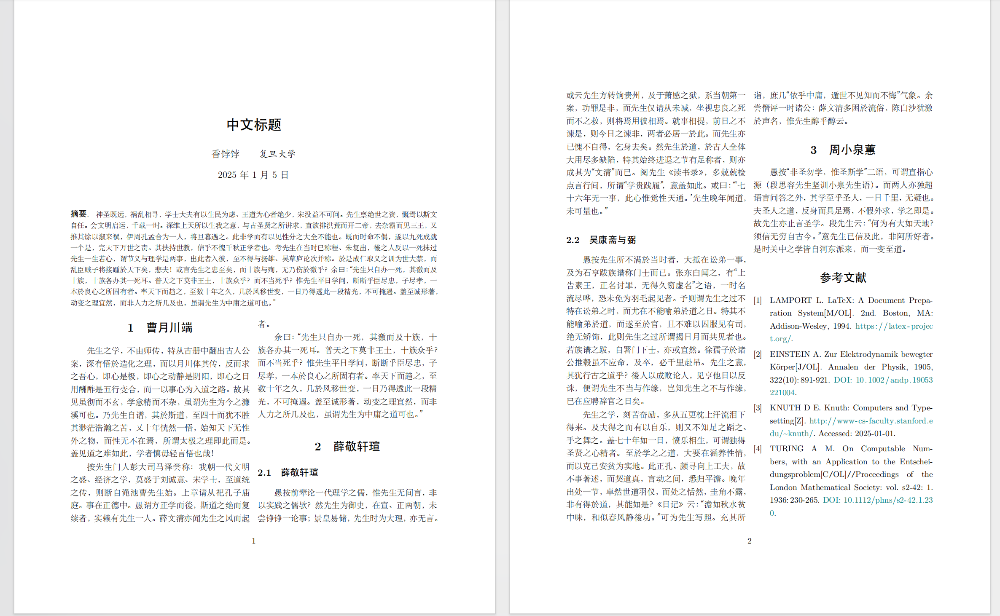

# spTemplate
This repository provides a collection of LaTeX class templates designed to enhance the clarity and conciseness of the main .tex files. It allows users to focus on the content of their work, rather than the intricacies of LaTeX code.

> [!Note]
> **Note**: This template is designed to provide an easy-to-use LaTeX writing framework for undergraduates who are new to LaTeX but need it for their writing tasks. 

> [!Warning]
> **Warning**: ⚠️ **Not** for Journal Submissions - This is not intended as a formal academic writing template for specific journals or conferences.

Purpose:
* 📄 Beginner-Friendly - Simplifies the LaTeX setup process, allowing users to focus on content rather than complex configurations.
* 🚀 Quick Start - Ideal for coursework, notes, and general document preparation.

### Example
Here is a short example for `spArticle`:
```LaTeX
\documentclass[
    column = twocolumn,
    ref = refDemo.bib,
    lang = cn
]{spArticle}
\spTitle{中文标题}
\spAuthor{香饽饽}
\spAffiliation{复旦大学}

\begin{document}
    \lipsum[1-3]    % 假设是中文假文 assume here is chinese blindtext
\end{document}
```
**may** seems like:

Overall, the main `.tex` file requires no unnecessary or excessive code, allowing users to focus solely on their content without worrying about complex syntax or difficult-to-remember commands.

# How to Use

To get started, clone this repository to your local machine and copy the `.cls` file to your working directory.

```sh
git clone https://github.com/SweetPastry/spTemplate.git
```

For example, if you need to start writing an article for a homework assignment, copy `spArticle.cls` to your homework folder. Then, create a new `.tex` file for the content and a `.bib` file for references (if needed).

Refer to the instruction document in the doc folder for a quick guide on how to use the template.

### Compilation

To compile your document, use **`xelatex`** and **`biber`** in the following order:

```sh
xelatex <texfile>
biber <texfile>
xelatex <texfile>
xelatex <texfile>
```

This sequence ensures proper handling of references and document structure.

# Feedback
If you encounter any errors or warnings, please feel free to report them to the author.

# License
The entire codebase is under ***CC BY 4.0***.
